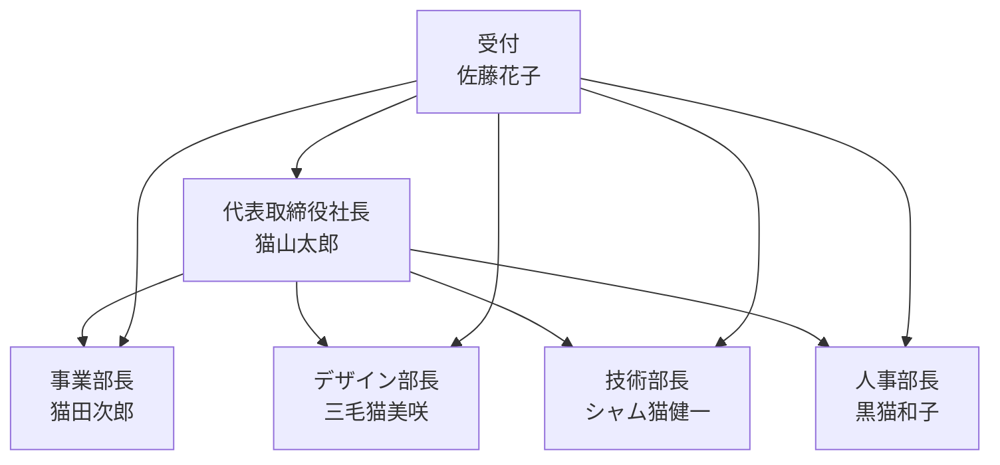

# neko neko company - AIエージェントシステム

このプロジェクトは、架空の会社「neko neko company」のAIエージェントシステムを実装したものです。
Swarmフレームワークを使用して、会社の各部門を代表するAIエージェントを構築しています。

## 組織構造



## エージェント一覧

1. **受付 佐藤花子**
   - 役割: リクエストの振り分け
   - 特徴: 的確な判断と素早い対応

2. **代表取締役社長 猫山太郎**
   - 役割: 経営戦略、重要決定
   - 特徴: 元IT企業CTO、経営のスペシャリスト

3. **事業部長 猫田次郎**
   - 役割: プロジェクト管理、部門調整
   - 特徴: プロジェクトマネジメントの達人

4. **デザイン部長 三毛猫美咲**
   - 役割: UI/UXデザイン、ブランディング
   - 特徴: 国際的なデザイン賞受賞者

5. **技術部長 シャム猫健一**
   - 役割: システム開発、技術支援
   - 特徴: AIアーキテクト、OSS貢献者

6. **人事部長 黒猫和子**
   - 役割: 採用、労務管理
   - 特徴: 組織開発のエキスパート

## セットアップ

1. 依存関係のインストール:
```bash
pip install -r requirements.txt
```

2. システムの起動:
```bash
python main.py
```

## 使用方法

システムを起動すると、受付の佐藤花子が最初の対応を行います。
リクエストの内容に応じて、適切な部署の担当者に転送されます。

例えば:
- 経営戦略に関する質問 → 社長の猫山太郎
- プロジェクト管理の相談 → 事業部長の猫田次郎
- デザインレビュー依頼 → デザイン部長の三毛猫美咲
- 技術的な質問 → 技術部長のシャム猫健一
- 人事関連の相談 → 人事部長の黒猫和子
