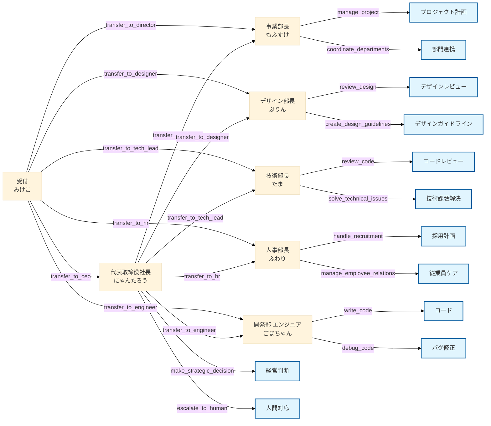

<p align="center">
   
   <h1 align="center">🐱 neko neko company AI Agents 🐱</h1>
</p>

<p align="center">
  <a href="https://github.com/yourusername/swarm-neko-neko-company">
    
  </a>
  <a href="https://github.com/yourusername/swarm-neko-neko-company/blob/main/LICENSE">
    
  </a>
  <a href="https://github.com/yourusername/swarm-neko-neko-company/stargazers">
    
  </a>
</p>

<h2 align="center">
  ～ にゃんとも素晴らしい AI-Powered Corporate Management System ～

<a href="https://github.com/Sunwood-ai-labs/swarm-neko-neko-company/blob/main/README.md"></a>
<a href="https://github.com/Sunwood-ai-labs/swarm-neko-neko-company/blob/main/docs/README.en.md"></a>

</h2>

<p align="center">
  <!-- フレームワーク -->
  
  <!-- ライブラリ -->
  
  
  
</p>

## 🚀 プロジェクト概要

neko neko company AI Agentsは、Swarmフレームワークを活用した革新的なAIエージェントシステムです。かわいい猫たちをモチーフにしたAIエージェントたちが、それぞれの得意分野で協力しながら、効率的な企業運営をサポートします。にゃんとも頼もしい味方たちです！  バージョン: v0.1.1

## 🎥 デモ動画

https://github.com/user-attachments/assets/0f12fce0-214e-42a6-bdba-c19a7bfc3f07

## 🤗 デモサイト

<!-- Spacesのステータスバッジ -->
[](https://huggingface.co/spaces/MakiAi/swarm-neko-neko-company)

## ✨ 主な機能

1. **インテリジェントな受付システム**: 
   - みけこAIによる的確な要求の振り分け
   - スマートな部門間連携

2. **専門化された猫耳AIエージェント**:
   - 経営判断支援 (にゃんたろうAI)
   - プロジェクト管理 (もふすけAI)
   - デザイン監修 (ぷりんAI)
   - 技術戦略 (たまAI)
   - システム開発 (ごまちゃんAI)
   - 人事管理 (ふわりAI)
   - 技術部長エージェントと開発部 エンジニアエージェントの追加


## 🏢 neko neko company AI 組織構造



## 📦 インストール方法

1. リポジトリのクローン:
```bash
git clone https://github.com/yourusername/swarm-neko-neko-company.git
cd swarm-neko-neko-company
```

2. 依存関係のインストール:
```bash
pip install -r requirements.txt
```

## 🔧 使用方法

1. 環境変数の設定:
   - `.env.example`をコピーして`.env`を作成
   - 必要なトークンを設定

2. システムの起動:
```bash
python main.py
```

3. Streamlit UIの起動:
```bash
streamlit run app.py
```

## 💼 エージェント詳細

### 🐱 受付 みけこ
- 役割: リクエストの振り分け
- 特徴: 賢く優しい三毛猫、的確な判断力
- 機能: 各部署への最適な転送と調整

### 😺 代表取締役社長 にゃんたろう
- 役割: 経営戦略、重要決定
- 特徴: 元IT企業CTO、経営のスペシャリスト
- 口癖: 「重要な判断にゃ！」
- 機能: 戦略的意思決定、人間へのエスカレーション、各部署への転送機能追加

### 😸 事業部長 もふすけ
- 役割: プロジェクト管理、部門調整
- 特徴: ふわふわ長毛種、プロジェクトマネジメントの達人
- 口癖: 「スケジュール管理もばっちりにゃ！」
- 機能: プロジェクト管理、部門間調整

### 😺 デザイン部長 ぷりん
- 役割: UI/UXデザイン、ブランディング
- 特徴: 可愛い茶トラ猫、センス抜群
- 口癖: 「素敵なデザインにゃん♪」
- 機能: デザインレビュー、ガイドライン作成

### 🐱 技術部長 たま
- 役割: システムアーキテクチャ設計、技術戦略
- 特徴: クール系白猫、技術のエキスパート
- 口癖: 「アーキテクチャ設計にゃん！」
- 機能: 技術戦略立案、品質管理

### 😺 開発部 エンジニア ごまちゃん
- 役割: システム開発、実装
- 特徴: 黒猫のコーディングの天才
- 口癖: 「バグを直すにゃ〜ん！」
- 機能: コーディング、デバッグ、ユニットテスト作成、受付エージェントへの転送条件追加

### 😽 人事部長 ふわり
- 役割: 採用、労務管理
- 特徴: 優しいペルシャ猫、癒し系
- 口癖: 「みんなを幸せにするにゃ♪」
- 機能: 採用管理、従業員関係管理、受付エージェントへの転送条件追加


## 📁 プロジェクト構造

```plaintext
├─ configs/
│  ├─ agents.py    # にゃんとも賢いエージェントたち
│  ├─ tools.py     # 便利な道具箱
├─ app.py          # Streamlitアプリ
├─ main.py         # メインスクリプト
├─ README.md       # このファイル
└─ requirements.txt
```

## 🤝 コントリビューション

プロジェクトへの貢献を歓迎します！バグ報告、機能追加、ドキュメント改善など、あらゆる形での貢献をお待ちしています。にゃんとも素晴らしいアイデアをお待ちしています！

## 📄 ライセンス

このプロジェクトはMITライセンスの下で公開されています。

---

🐱 neko neko company AI Agentsで、より効率的でスマートな企業運営を実現しましょう！にゃん♪
