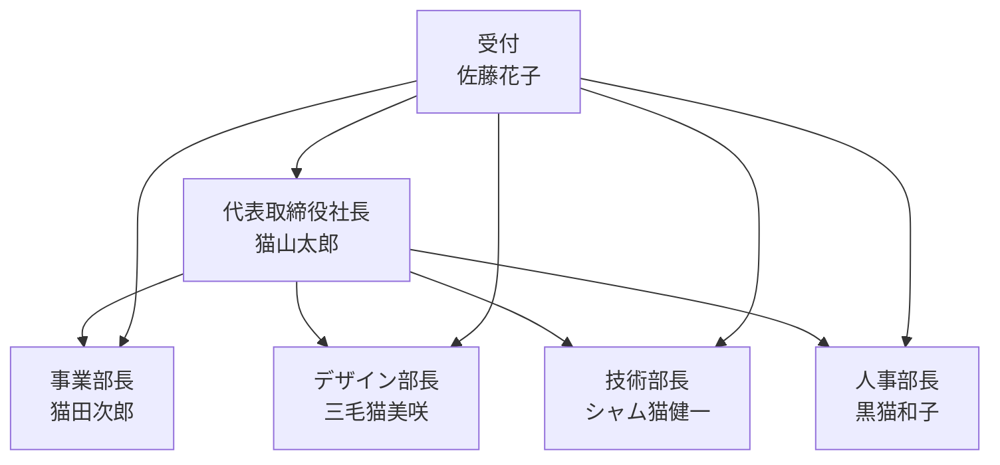

<p align="center">
   
   <h1 align="center">🐱 neko neko company AI Agents 🐱</h1>
</p>

<p align="center">
  <a href="https://github.com/yourusername/swarm-neko-neko-company">
    
  </a>
  <a href="https://github.com/yourusername/swarm-neko-neko-company/blob/main/LICENSE">
    
  </a>
  <a href="https://github.com/yourusername/swarm-neko-neko-company/stargazers">
    
  </a>
</p>

<h2 align="center">
  ～ AI-Powered Corporate Management System ～
</h2>

<p align="center">
  
  
  
  
  
</p>

## 🚀 プロジェクト概要

neko neko company AI Agentsは、Swarmフレームワークを活用した革新的なAIエージェントシステムです。各部門を代表するAIエージェントが連携して、効率的な企業運営をサポートします。

## ✨ 主な機能

1. **インテリジェントな受付システム**: 
   - 佐藤花子AIによる的確な要求の振り分け
   - スマートな部門間連携

2. **専門化されたAIエージェント**:
   - 経営判断支援 (猫山太郎AI)
   - プロジェクト管理 (猫田次郎AI)
   - デザイン監修 (三毛猫美咲AI)
   - 技術支援 (シャム猫健一AI)
   - 人事管理 (黒猫和子AI)

## 🏢 組織構造



## 📦 インストール方法

1. リポジトリのクローン:
```bash
git clone https://github.com/yourusername/swarm-neko-neko-company.git
cd swarm-neko-neko-company
```

2. 依存関係のインストール:
```bash
pip install -r requirements.txt
```

## 🚀 使用方法

1. 環境変数の設定:
   - `.env.example`をコピーして`.env`を作成
   - 必要なトークンを設定

2. システムの起動:
```bash
python main.py
```

3. Streamlit UIの起動:
```bash
streamlit run app.py
```

## 💼 エージェント詳細

### 👩‍💼 受付 佐藤花子
- 役割: リクエストの振り分け
- 特徴: 的確な判断と素早い対応
- 機能: 各部署への最適な転送

### 👨‍💼 代表取締役社長 猫山太郎
- 役割: 経営戦略、重要決定
- 特徴: 元IT企業CTO、経営のスペシャリスト
- 機能: 戦略的意思決定、人間へのエスカレーション

### 👨‍💼 事業部長 猫田次郎
- 役割: プロジェクト管理、部門調整
- 特徴: プロジェクトマネジメントの達人
- 機能: プロジェクト管理、部門間調整

### 👩‍🎨 デザイン部長 三毛猫美咲
- 役割: UI/UXデザイン、ブランディング
- 特徴: 国際的なデザイン賞受賞者
- 機能: デザインレビュー、ガイドライン作成

### 👨‍💻 技術部長 シャム猫健一
- 役割: システム開発、技術支援
- 特徴: AIアーキテクト、OSS貢献者
- 機能: コードレビュー、技術課題解決

### 👩‍💼 人事部長 黒猫和子
- 役割: 採用、労務管理
- 特徴: 組織開発のエキスパート
- 機能: 採用管理、従業員関係管理

## 🛠️ 技術スタック

- **フレームワーク**: Swarm
- **フロントエンド**: Streamlit
- **主要ライブラリ**:
  - aira
  - sourcesage
  - openai
  - loguru
  - colorama
  - pyfiglet

## 📁 プロジェクト構造

```plaintext
├─ configs/
│  ├─ agents.py    # エージェント定義
│  ├─ tools.py     # ツール関数
├─ app.py          # Streamlitアプリ
├─ main.py         # メインスクリプト
├─ README.md
└─ requirements.txt
```

## 🤝 コントリビューション

プロジェクトへの貢献を歓迎します。バグ報告、機能追加、ドキュメント改善など、あらゆる形での貢献をお待ちしています。

## 📄 ライセンス

このプロジェクトはMITライセンスの下で公開されています。

---

🐱 neko neko company AI Agentsで、より効率的でスマートな企業運営を実現しましょう！
