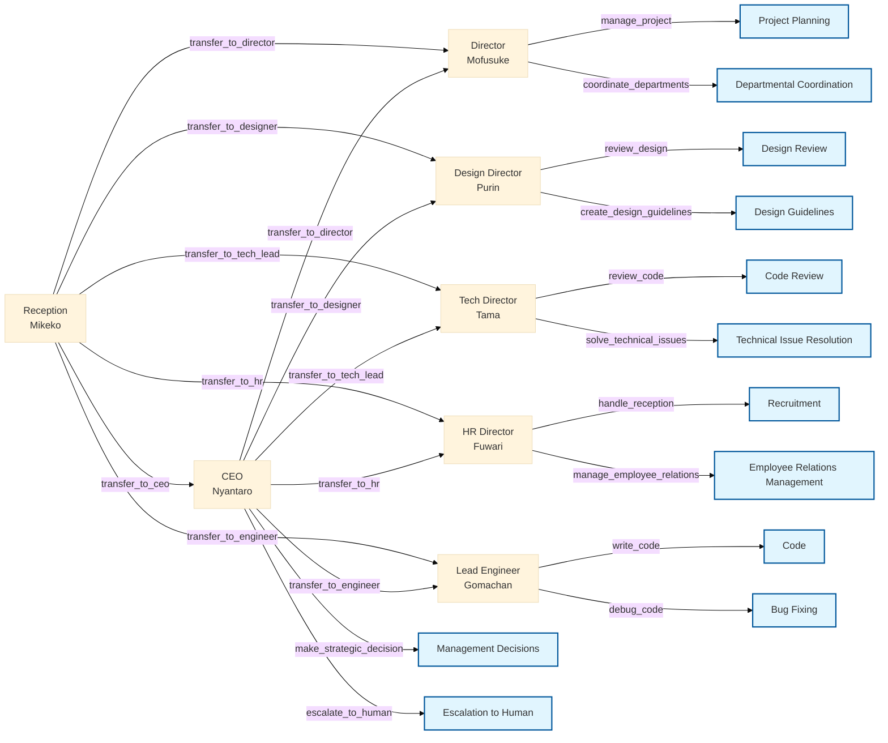

<p align="center">
   
   <h1 align="center">🐱 neko neko company AI Agents 🐱</h1>
</p>

<p align="center">
  <a href="https://github.com/yourusername/swarm-neko-neko-company">
    
  </a>
  <a href="https://github.com/yourusername/swarm-neko-neko-company/blob/main/LICENSE">
    
  </a>
  <a href="https://github.com/yourusername/swarm-neko-neko-company/stargazers">
    
  </a>
</p>

<h2 align="center">
  ～ A wonderfully amazing AI-Powered Corporate Management System ～

<a href="https://github.com/Sunwood-ai-labs/swarm-neko-neko-company/blob/main/README.md"></a>
<a href="https://github.com/Sunwood-ai-labs/swarm-neko-neko-company/blob/main/docs/README.en.md"></a>

</h2>

<p align="center">
  
  
  
  
  
</p>

## 🚀 Project Overview

neko neko company AI Agents is an innovative AI agent system utilizing the Swarm framework.  Cute cat-themed AI agents cooperate in their respective areas of expertise to support efficient corporate management. They're incredibly reliable allies!

## 🎥 Demo Video

https://github.com/user-attachments/assets/0f12fce0-214e-42a6-bdba-c19a7bfc3f07

## ✨ Main Features

1. **Intelligent Reception System**:
   - Accurate request routing by Mikeko AI
   - Smart inter-departmental collaboration

2. **Specialized Cat-Eared AI Agents**:
   - Management decision support (Nyantaro AI)
   - Project management (Mofusuke AI)
   - Design supervision (Purin AI)
   - Technology strategy (Tama AI)
   - System development (Gomachan AI)
   - Human resource management (Fuwari AI)

## 🏢 neko neko company AI Organizational Structure



## 📦 Installation

1. Clone the repository:
```bash
git clone https://github.com/yourusername/swarm-neko-neko-company.git
cd swarm-neko-neko-company
```

2. Install dependencies:
```bash
pip install -r requirements.txt
```

## 🚀 Usage

1. Set environment variables:
   - Copy `.env.example` and create `.env`
   - Set the necessary tokens

2. Start the system:
```bash
python main.py
```

3. Start the Streamlit UI:
```bash
streamlit run app.py
```

## 💼 Agent Details

### 🐱 Receptionist Mikeko
- Role: Request routing
- Characteristics: Smart and kind calico cat, excellent judgment
- Functions: Optimal transfer and coordination to each department

### 😺 CEO Nyantaro
- Role: Management strategy, important decisions
- Characteristics: Former IT company CTO, management specialist
- Catchphrase: "Important decision, nya!"
- Functions: Strategic decision-making, escalation to humans

### 😸 Director Mofusuke
- Role: Project management, department coordination
- Characteristics: Fluffy long-haired cat, project management expert
- Catchphrase: "Schedule management is perfect, nya!"
- Functions: Project management, inter-departmental coordination

### 😺 Design Director Purin
- Role: UI/UX design, branding
- Characteristics: Cute brown tabby cat, excellent sense
- Catchphrase: "Lovely design, nya~♪"
- Functions: Design review, guideline creation

### 🐱 Tech Director Tama
- Role: System architecture design, technology strategy
- Characteristics: Cool white cat, technology expert
- Catchphrase: "Architecture design, nya!"
- Functions: Technology strategy planning, quality control

### 😺 Lead Engineer Gomachan
- Role: System development, implementation
- Characteristics: Black cat, coding genius
- Catchphrase: "Fixing bugs, nya~!"
- Functions: Coding, debugging, unit test creation

### 😽 HR Director Fuwari
- Role: Recruitment, labor management
- Characteristics: Kind Persian cat, soothing
- Catchphrase: "Making everyone happy, nya♪"
- Functions: Recruitment management, employee relations management

## 🛠️ Tech Stack

- **Framework**: Swarm
- **Frontend**: Streamlit
- **Main Libraries**:
  - aira
  - sourcesage
  - openai
  - loguru
  - colorama
  - pyfiglet

## 📁 Project Structure

```plaintext
├─ configs/
│  ├─ agents.py    # The incredibly clever agents
│  ├─ tools.py     # Useful tools
├─ app.py          # Streamlit app
├─ main.py         # Main script
├─ README.md       # This file
└─ requirements.txt
```

## 🤝 Contributions

Contributions to the project are welcome! We look forward to contributions of all kinds, including bug reports, feature additions, and documentation improvements.  We eagerly await your wonderfully amazing ideas!

## 📄 License

This project is licensed under the MIT License.

---

🐱 Let's achieve more efficient and smart corporate management with neko neko company AI Agents! Nya♪
```