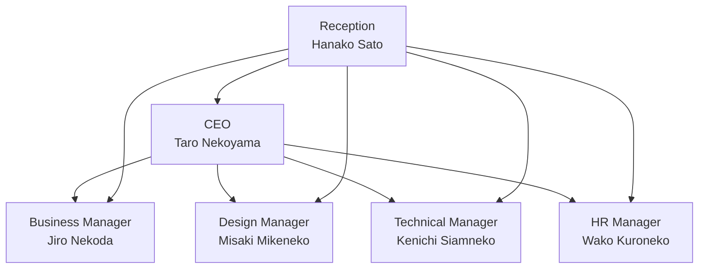

<p align="center">
   
   <h1 align="center">🐱 neko neko company AI Agents 🐱</h1>
</p>

<p align="center">
  <a href="https://github.com/yourusername/swarm-neko-neko-company">
    
  </a>
  <a href="https://github.com/yourusername/swarm-neko-neko-company/blob/main/LICENSE">
    
  </a>
  <a href="https://github.com/yourusername/swarm-neko-neko-company/stargazers">
    
  </a>
</p>

<h2 align="center">
  ～ AI-Powered Corporate Management System ～
</h2>

<p align="center">
  
  
  
  
  
</p>

## 🚀 Project Overview

neko neko company AI Agents is an innovative AI agent system utilizing the Swarm framework.  AI agents representing each department collaborate to support efficient corporate management.

## ✨ Main Features

1. **Intelligent Reception System**:
   - Accurate request routing by Hanako Sato AI.
   - Smart inter-departmental collaboration.

2. **Specialized AI Agents**:
   - Management Support (Taro Nekoyama AI)
   - Project Management (Jiro Nekoda AI)
   - Design Supervision (Misaki Mikeneko AI)
   - Technical Support (Kenichi Siamneko AI)
   - Human Resources Management (Wako Kuroneko AI)


## 🏢 Organizational Structure



## 📦 Installation

1. Clone the repository:
```bash
git clone https://github.com/yourusername/swarm-neko-neko-company.git
cd swarm-neko-neko-company
```

2. Install dependencies:
```bash
pip install -r requirements.txt
```

## 🚀 Usage

1. Set environment variables:
   - Copy `.env.example` and create `.env`.
   - Set the necessary tokens.

2. Start the system:
```bash
python main.py
```

3. Start the Streamlit UI:
```bash
streamlit run app.py
```

## 💼 Agent Details

### 👩‍💼 Receptionist: Hanako Sato
- Role: Request routing
- Characteristics: Accurate judgment and quick response
- Functionality: Optimal transfer to each department

### 👨‍💼 CEO: Taro Nekoyama
- Role: Management strategy, important decisions
- Characteristics: Former CTO of an IT company, management specialist
- Functionality: Strategic decision-making, escalation to humans

### 👨‍💼 Business Manager: Jiro Nekoda
- Role: Project management, inter-departmental coordination
- Characteristics: Project management expert
- Functionality: Project management, inter-departmental coordination

### 👩‍🎨 Design Manager: Misaki Mikeneko
- Role: UI/UX design, branding
- Characteristics: Winner of international design awards
- Functionality: Design review, guideline creation

### 👨‍💻 Technical Manager: Kenichi Siamneko
- Role: System development, technical support
- Characteristics: AI architect, OSS contributor
- Functionality: Code review, technical problem solving

### 👩‍💼 HR Manager: Wako Kuroneko
- Role: Recruitment, labor management
- Characteristics: Organizational development expert
- Functionality: Recruitment management, employee relations management


## 🛠️ Tech Stack

- **Framework**: Swarm
- **Frontend**: Streamlit
- **Key Libraries**:
  - aira
  - sourcesage
  - openai
  - loguru
  - colorama
  - pyfiglet

## 📁 Project Structure

```plaintext
├─ configs/
│  ├─ agents.py    # Agent definitions
│  ├─ tools.py     # Tool functions
├─ app.py          # Streamlit app
├─ main.py         # Main script
├─ README.md
└─ requirements.txt
```

## 🤝 Contributions

Contributions to the project are welcome. We encourage bug reports, feature additions, documentation improvements, and any other form of contribution.

## 📄 License

This project is licensed under the MIT License.

---

🐱 Let's achieve more efficient and smart corporate management with neko neko company AI Agents!
```