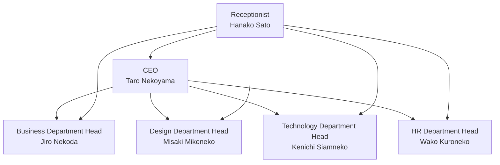

# neko neko company - AI Agent System

This project implements an AI agent system for the fictional company "neko neko company."  It uses the Swarm framework to build AI agents representing each department of the company.

## Organizational Structure



## Agent List

1. **Receptionist Hanako Sato**
   - Role: Request routing
   - Characteristics: Accurate judgment and quick response

2. **CEO Taro Nekoyama**
   - Role: Management strategy, important decisions
   - Characteristics: Former CTO of an IT company, management specialist

3. **Business Department Head Jiro Nekoda**
   - Role: Project management, department coordination
   - Characteristics: Project management expert

4. **Design Department Head Misaki Mikeneko**
   - Role: UI/UX design, branding
   - Characteristics: Winner of international design awards

5. **Technology Department Head Kenichi Siamneko**
   - Role: System development, technical support
   - Characteristics: AI architect, OSS contributor

6. **HR Department Head Wako Kuroneko**
   - Role: Recruitment, labor management
   - Characteristics: Organizational development expert


## Setup

1. Install dependencies:
```bash
pip install -r requirements.txt
```

2. Start the system:
```bash
python main.py
```

## Usage

When you start the system, Hanako Sato at the reception will handle the initial request.  Depending on the content of the request, it will be forwarded to the appropriate department.

For example:

- Questions regarding management strategy → CEO Taro Nekoyama
- Project management consultation → Business Department Head Jiro Nekoda
- Design review request → Design Department Head Misaki Mikeneko
- Technical questions → Technology Department Head Kenichi Siamneko
- HR-related consultations → HR Department Head Wako Kuroneko