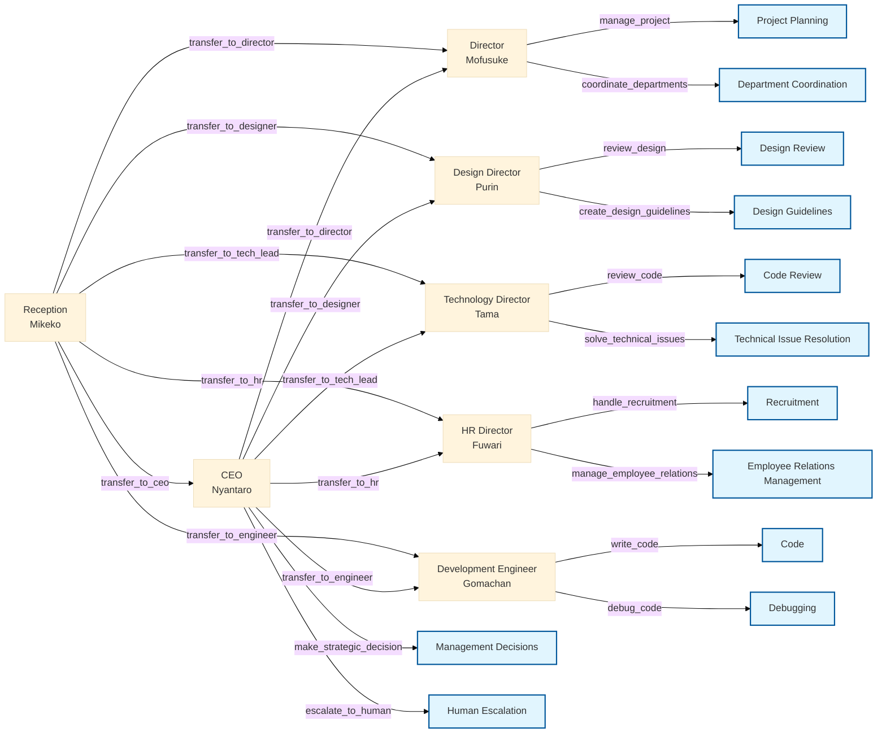

<p align="center">
   
   <h1 align="center">🐱 neko neko company AI Agents 🐱</h1>
</p>

<p align="center">
  <a href="https://github.com/yourusername/swarm-neko-neko-company">
    
  </a>
  <a href="https://github.com/yourusername/swarm-neko-neko-company/blob/main/LICENSE">
    
  </a>
  <a href="https://github.com/yourusername/swarm-neko-neko-company/stargazers">
    
  </a>
</p>

<h2 align="center">
  ～ A wonderfully amazing AI-Powered Corporate Management System ～

<a href="https://github.com/Sunwood-ai-labs/swarm-neko-neko-company/blob/main/README.md"></a>
<a href="https://github.com/Sunwood-ai-labs/swarm-neko-neko-company/blob/main/docs/README.en.md"></a>

</h2>

<p align="center">
  <!-- Frameworks -->
  
  <!-- Libraries -->
  
  
  
</p>

## 🚀 Project Overview

neko neko company AI Agents is an innovative AI agent system utilizing the Swarm framework.  Cute cat-themed AI agents cooperate in their respective areas of expertise to support efficient corporate management. They're incredibly reliable allies! Version: v0.1.1

## 🎥 Demo Video

https://github.com/user-attachments/assets/0f12fce0-214e-42a6-bdba-c19a7bfc3f07

## 🤗 Demo Site

<!-- Spaces status badge -->
[](https://huggingface.co/spaces/MakiAi/swarm-neko-neko-company)

## ✨ Main Features

1. **Intelligent Reception System**:
   - Accurate request routing by Mikeko AI
   - Smart inter-departmental collaboration

2. **Specialized Cat-Eared AI Agents**:
   - Management support (Nyantaro AI)
   - Project management (Mofusuke AI)
   - Design supervision (Purin AI)
   - Technology strategy (Tama AI)
   - System development (Gomachan AI)
   - Human resource management (Fuwari AI)
   - Addition of a Technology Department Head agent and Development Department engineer agent


## 🏢 neko neko company AI Organizational Structure



## 📦 Installation

1. Clone the repository:
```bash
git clone https://github.com/yourusername/swarm-neko-neko-company.git
cd swarm-neko-neko-company
```

2. Install dependencies:
```bash
pip install -r requirements.txt
```

## 🔧 Usage

1. Set environment variables:
   - Copy `.env.example` and create `.env`
   - Set the necessary tokens

2. Start the system:
```bash
python main.py
```

3. Start the Streamlit UI:
```bash
streamlit run app.py
```

## 💼 Agent Details

### 🐱 Receptionist: Mikeko
- Role: Request routing
- Characteristics: A clever and kind calico cat with excellent judgment
- Functions: Optimal transfer and coordination to each department

### 😺 CEO: Nyantaro
- Role: Management strategy, important decisions
- Characteristics: Former CTO of an IT company, management specialist
- Catchphrase: "Important decision time!"
- Functions: Strategic decision-making, human escalation, added transfer function to each department

### 😸 Director: Mofusuke
- Role: Project management, department coordination
- Characteristics: Fluffy long-haired cat, master of project management
- Catchphrase: "Schedule management is perfect!"
- Functions: Project management, inter-departmental coordination

### 😺 Design Director: Purin
- Role: UI/UX design, branding
- Characteristics: Cute brown tabby cat, excellent sense of design
- Catchphrase: "Wonderful design!"
- Functions: Design review, guideline creation

### 🐱 Technology Director: Tama
- Role: System architecture design, technology strategy
- Characteristics: Cool white cat, technology expert
- Catchphrase: "Architecture design!"
- Functions: Technology strategy planning, quality management

### 😺 Development Engineer: Gomachan
- Role: System development, implementation
- Characteristics: Black cat, coding genius
- Catchphrase: "Fixing bugs!"
- Functions: Coding, debugging, unit test creation, added transfer condition to the reception agent

### 😽 HR Director: Fuwari
- Role: Recruitment, labor management
- Characteristics: Gentle Persian cat, soothing
- Catchphrase: "Making everyone happy!"
- Functions: Recruitment management, employee relations management, added transfer condition to the reception agent


## 📁 Project Structure

```plaintext
├─ configs/
│  ├─ agents.py    # The wonderfully clever agents
│  ├─ tools.py     # Useful tools
├─ app.py          # Streamlit app
├─ main.py         # Main script
├─ README.md       # This file
└─ requirements.txt
```

## 🤝 Contributions

Contributions to the project are welcome! We look forward to contributions of all kinds, including bug reports, feature additions, and documentation improvements. We are eagerly awaiting your wonderfully amazing ideas!

## 📄 License

This project is licensed under the MIT License.

---

🐱 Let's achieve more efficient and smart corporate management with neko neko company AI Agents! Meow♪